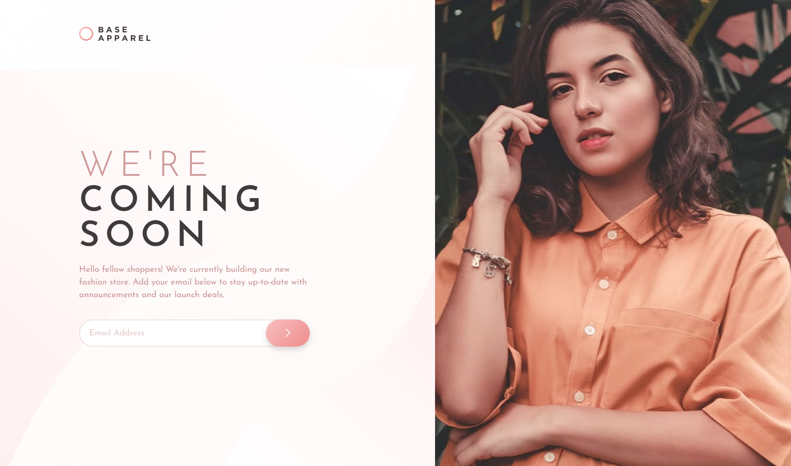

# Frontend Mentor - Base Apparel coming soon page solution

This is a solution to the [Base Apparel coming soon page challenge on Frontend Mentor](https://www.frontendmentor.io/challenges/base-apparel-coming-soon-page-5d46b47f8db8a7063f9331a0). Frontend Mentor challenges help you improve your coding skills by building realistic projects. 

## Table of contents

- [Overview](#overview)
  - [The challenge](#the-challenge)
  - [Screenshot](#screenshot)
  - [Links](#links)
- [My process](#my-process)
  - [Built with](#built-with)
  - [Challenges](#challenges)
- [Author](#author)

## Overview

### The challenge

Users should be able to:

- View the optimal layout for the site depending on their device's screen size
- See hover states for all interactive elements on the page
- Receive an error message when the `form` is submitted if:
  - The `input` field is empty
  - The email address is not formatted correctly

### Screenshot



### Links

- Solution URL: [Add solution URL here](https://your-solution-url.com)
- Live Site URL: [Add live site URL here](https://your-live-site-url.com)

## My process

### Built with

- Semantic HTML5 markup
- CSS custom properties
- Flexbox
- CSS Grid
- Mobile-first workflow
- SCSS
- Vanilla JavaScript

### Challenges

- background image was a bit tricky
- added safety measures for hero content (scss line 26)

```css
body{

  @include lg-min{
    padding-bottom: 0;
    background-image: url("../images/hero-desktop.jpg");
    background-repeat: no-repeat;
    background-position: right;
    background-size: contain;
  }
}

.hero__content{
  /* adding background in case of collision with background image */
  background-color: rgb(#fff, 0.85);
  border-radius: 0 rem(8) rem(8) 0 ;
  padding: 1rem 1rem 1rem 0;
  z-index: 999;
}
```

## Author

- Frontend Mentor - [@pyaetheiN](https://www.frontendmentor.io/profile/pyaetheiN)
- Twitter - [@pt_boyyy](https://www.twitter.com/pt_boyyy)